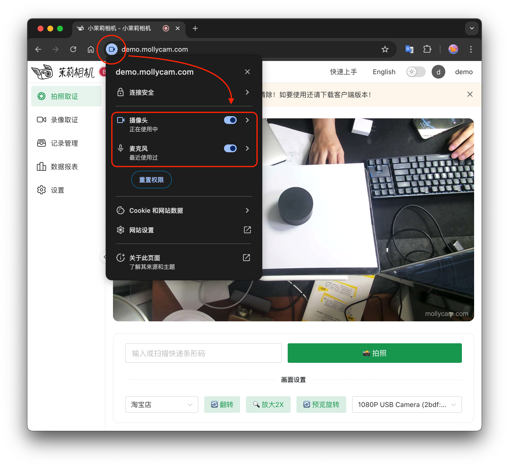

# 快速上手

## 一、DEMO 体验

您可以先尝试预览我们的在线 DEMO，体验完整的功能。
👉 [立即体验](https://demo.mollycam.com) 基础功能演示版本

<n-a href="https://demo.mollycam.com" target="_blank">
    <n-button secondary type="error">
        <template #icon>
        <n-icon>
          <EyeOutline />
        </n-icon>
      </template>
        DEMO 预览
    </n-button>
</n-a>

### 首次体验必看！

::: danger DEMO 体验注意事项

首次打开浏览器 DEMO（以 Safari 为例），可能会出现”摄像头检测“提示，需要设置浏览器”网站设置“允许访问您的摄像头和麦克风。

:::

点击浏览器的”网站设置“选项

设置允许访问摄像头和麦克风；

修改设置后，即可正常使用 DEMO。

Chrome 浏览器同理，需要在浏览器”网站设置“中允许摄像头和麦克风的权限。

## 二、硬件准备

::: warning 必备硬件清单
#### 🖥️ 电脑主机：运行 MollyCam 客户端
> 此取证相机必须连接电脑使用，没有电脑将无法运行；

#### 📷 高清摄像头：记录视频影像
> 此取证相机必须连接摄像头使用，没有摄像头将无法运行；

#### 🔫 扫码枪：快速录入物流信息
> 支持有线无线二维码扫码枪；
::: 

### 1. 电脑配置要求

#### Windows 系统
- 操作系统：Windows 10 64位 及以上
- 处理器：Intel Core i3 或同等性能 CPU
- 内存：4GB RAM 及以上
- 硬盘空间：至少 500GB 可用空间
- USB 接口：至少2个 USB 2.0 或以上

#### MacOS 系统
- 操作系统：macOS 10.15 及以上
- 处理器：Intel 或 Apple Silicon
- 内存：4GB RAM 及以上
- 硬盘空间：至少 50GB 可用空间
- USB 接口：至少2个 USB 2.0 或以上

#### 硬盘存储大小建议
- 例如1分钟视频占用空 100M，每天打包100个包裹，占用 10G 空间，1T 硬盘可存储100天视频。
- 如果需要长期存储，建议使用网络存储设备，如NAS、云盘等。
- 可以定期删除很久之前的视频，只保留近期的视频。

### 2. 摄像头选择

> 摄像头需要单独购买

基本要求
- 分辨率：1080P 及以上，推荐2K或4K分辨率输出的摄像头
- 接口类型：USB 即插即用
- 视角：90°以上广角
- 对焦：自动对焦

### 3. 扫码枪规格

> 扫码枪需要单独购买

基本要求
- 支持常见一维码/二维码格式
- USB 接口即插即用
- 支持连续扫描模式

### 4. 设备连接

设备连接示意：

## 二、软件准备

### 1. 客户端下载

::: danger 客户端

单机个人版客户端下载：[下载安装](/guide/download) 

:::

### 2. 客户端安装

1. 下载对应系统的安装包
2. 运行安装程序
3. 完成初始化配置

## 三、开始使用

### 1. 设备连接

1. 连接摄像头
2. 连接扫码枪
3. 检查设备识别状态

### 2. 功能测试

1. 测试摄像头画面
2. 测试扫码功能
3. 测试录制存储

### 3. 开始取证

- 确保光线充足
- 保持画面稳定
- 重要信息同框
- 规范操作流程

